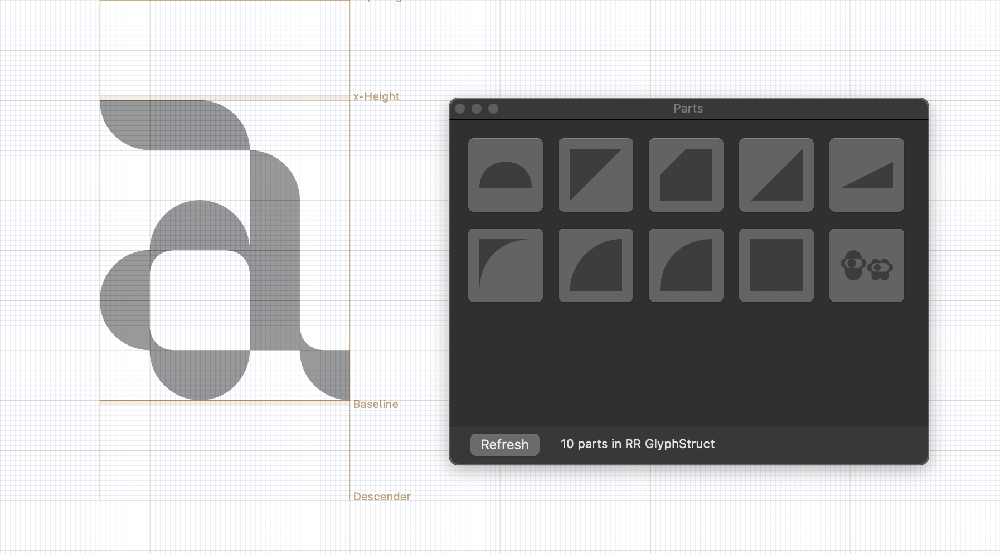

# RR GlyphStruct

**RR GlyphStruct** is a Glyphs 3 setup for building glyphs from reusable structural components.
The repository contains a specially prepared Glyphs file with ready-made `.part` components, plus a small helper plugin that makes it easier to insert those components while drawing.



## Download

Download the latest ZIP from the [Releases](https://github.com/ruzvaliakhmetov/rr_glyphstruct/releases/latest) page.

## Installation

Unzip the archive, double-click `PartInserter.glyphsPlugin`, then restart Glyphs.

## Usage

Open the included Glyphs file, then choose:

```text
Window → Part Inserter
