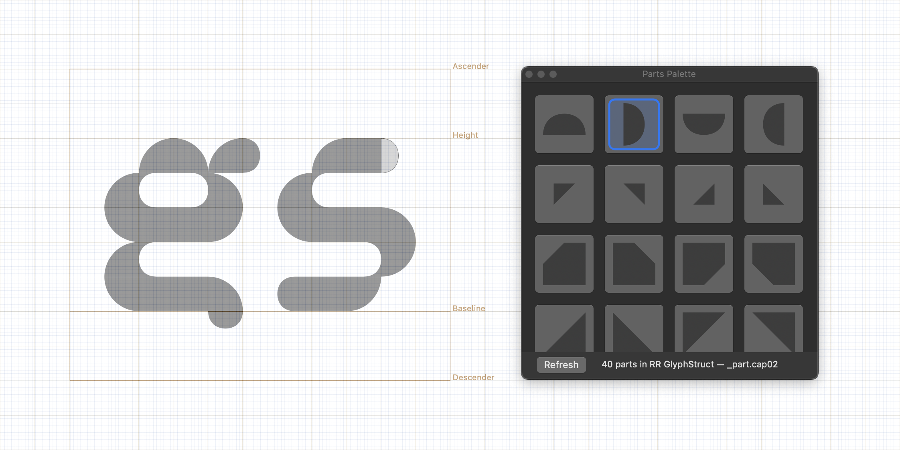

# RR GlyphStruct



**RR GlyphStruct** is a modular Glyphs 3 file with ready-made ```_part.*``` components and two helper plugins for inserting them while drawing.

## Part Inserter

Use **Part Inserter** when you want to quickly insert a component into the active glyph layer.

Open it from:

```text
Window → Part Inserter
```

Click any part preview to insert it.

## Part Brush

Use **Part Brush** when you want to choose a component and place it manually on the canvas.

Select the **Part Brush** tool in the toolbar, choose a part in the **Parts Palette**, then click on the canvas to place it. The preview snaps to the font grid before insertion.

## Download

Download the latest ZIP from the [Releases](https://github.com/ruzvaliakhmetov/rr_glyphstruct/releases/latest) page.

What’s included

* ```rr_glyphstruct.glyphs``` — a Glyphs 3 file with reusable ```_part.*``` components
* ```PartInserter.glyphsPlugin``` — a floating palette for quick component insertion
* ```PartBrush.glyphsTool``` — a toolbar tool for placing components directly on the canvas

## Installation

Unzip the archive and double-click the plugins you want to install:

```text
PartInserter.glyphsPlugin
PartBrush.glyphsTool
```

Then restart Glyphs.

*The plugins are independent from each other, so you don’t need to install both. Pick the one that fits your workflow best, or install both if you like switching between different ways of placing parts.*

---